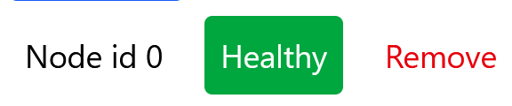

> N.b Swim vis is intended for use on a desktop browser. Usage on other devices may result in a degraded experience
> 
# Swim Vis Usage Guide
This guide should cover general usage for interacting with Swim Vis and making the most of the tool as a learning resource

## Getting started
To get started Click the "Open Panel" button at the top left hand corner of the website. This should open the settings tray where you can configure the network.

## Adding a node
Click on the "add node" button to add a new node to the network. Doing so will reset the positions of all other nodes.

Once a node has been added it will attempt to join the network using the selected "dissemination" method. 

Nodes can be:
 - **Toggled to be faulty**: This will stop the node from sending or receiving messages simulating a node failure. 
 - **Removed**: This will remove the node from the network. (Node will still be visible but not active)